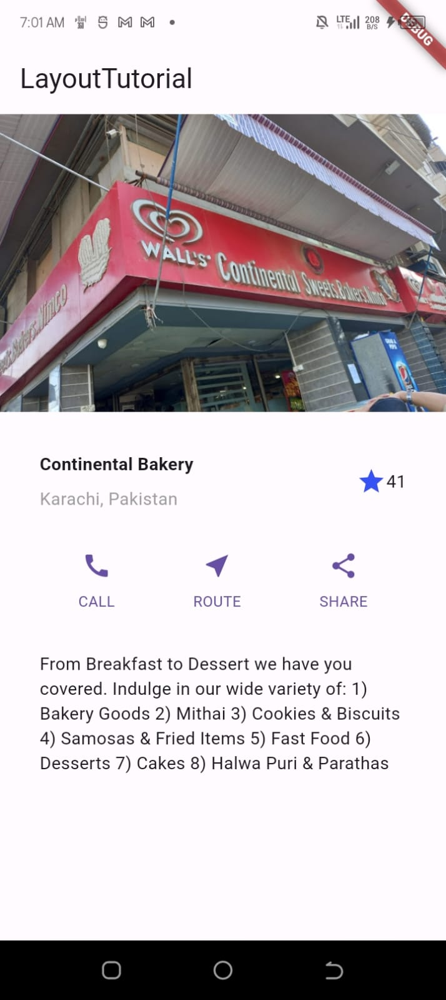

# flutterlayout_week3

A simple 1 page ToDo list Application developed using the flutter framework (V3.2.6) and dart. Demonstrates the use of Stateless Widgets and how to use them to structure the layout of the User interface.

